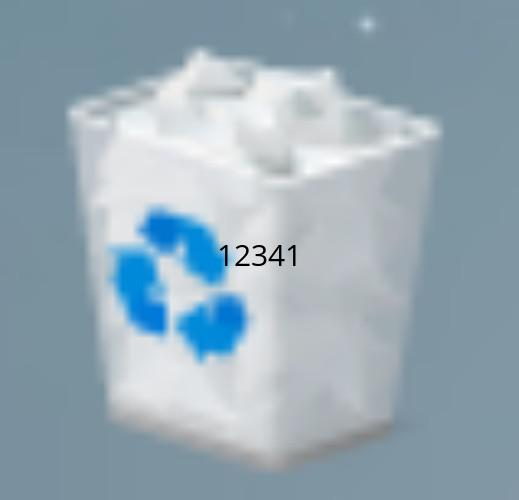
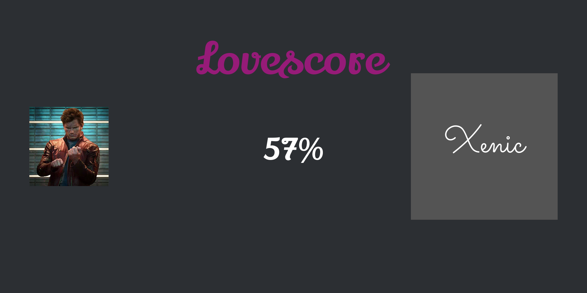

# Raw Data for DBM
When you use the raw-data the bot will send an image this into the channel.
Look at the raws, they aren't  complex because it is powered by my api which generates near to all.
# Welcome image:

Create an event (you should know how to) which send a image to an channel if someone joins.

## How to:

First store the member name, avatar url and server name (current server).
Create an image like this:
`https://braslerl-api.herokuapp.com/discord/welcome/{theme}?memberavatar={avatar url}&servername={servername}&membername={membername}`

## Replace the "{}" with:

 - `theme` you can choose a theme (we have five atm: blue, red, green, pink, discord)
 - `avatar url` put in here the avatar url variable you stored
 - `servername` put in here the server name you stored
 - `membername` put in here the member name you stored
 You did it, now a image will be sent when a new member joins (if you did nothing wrong)

**Result:**

`https://braslerl-api.herokuapp.com/discord/welcome/blue?memberavatar=https://cdn.discordapp.com/avatars/332229703177994251/cf731d36720430ce4fff59962f8ef94f.png?size=4096&servername=Xenics%20Server&membername=Xenic`

 

 

# Raw Data download (for the lazy)
## Trash:

[Rawdata for trash here](raw/trash.txt)

## Glitch effect:

[Rawdata for trash here](raw/trash.txt)

## Ship:

[Rawdata for ship here](raw/ship.txt)

## Level:

[Rawdata for level here](raw/level.txt)

Tip:
In [level](raw/level.txt) you can replace a part from the url:

`https://braslerl-api.herokuapp.com/discord/level/blue?number=${tempVars(\"procent\")}&level=${tempVars(\"myLevel\")}`

replace `blue` with `discord`, `green`, `red` or  `pink` to get another theme
Themes you can see here:

# Contact:
Contact me [here](https://braslerl-api.herokuapp.com/contact)
